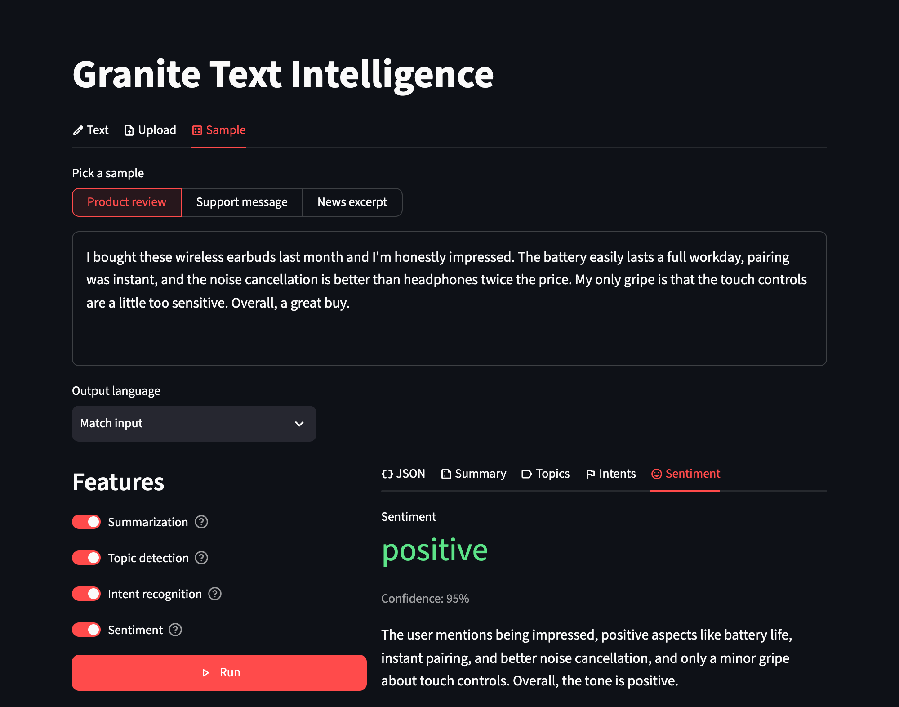

# Granite Text Intelligence

[](https://github.com/darylalim/granite-text-intelligence/actions/workflows/ci.yml)
[](https://github.com/darylalim/granite-text-intelligence/releases/latest)
[](LICENSE)

**Granite Text Intelligence** is a Streamlit application for **summarization, topic, intent, and sentiment analysis** using IBM's [granite-4.2-3b](https://huggingface.co/ibm-granite/granite-4.2-3b) on Apple Silicon with [MLX](https://github.com/ml-explore/mlx) (Apple's on-device ML framework, via `mlx-lm`), running locally. It's a single-shot playground: provide text, choose which analyses to run, and get the results back — all powered by prompting one Granite model. Results can be returned in the input's language or any of Granite's 12 supported languages.



Requires an Apple Silicon (M-series) Mac with ~16 GB+ of unified memory — the default model is IBM's own full-precision MLX build of the 3B ([`ibm-granite/granite-4.2-3b-bf16-mlx`](https://huggingface.co/ibm-granite/granite-4.2-3b-bf16-mlx)), which uses ~7.3 GB for weights plus up to ~1.3 GB of KV cache at the default input length. For the larger 8B at about the same footprint, set `MODEL_NAME` in `streamlit_app.py` to `ibm-granite/granite-4.2-8b-q4-mlx` (~5 GB, 4-bit); on a 32 GB+ Mac, `ibm-granite/granite-4.2-8b-q8-mlx` (~9.3 GB) or `ibm-granite/granite-4.2-8b-bf16-mlx` (~17.6 GB, full precision).

## Setup

Requires [uv](https://docs.astral.sh/uv/getting-started/installation/), which provisions Python 3.12 (per `.python-version`) and all dependencies for you.

```bash
uv sync
uv run streamlit run streamlit_app.py
```

The model (~7.3 GB, bf16) downloads automatically the first time you click **Run** (you'll see a "Loading model…" spinner counting the seconds) and is cached for later runs.

### Troubleshooting

- **First Run is slow.** The initial click loads ~7.3 GB into unified memory; the "Loading model…" and per-feature spinners mean it's working, not hung.
- **Out of memory?** Lower `MAX_INPUT_TOKENS` to shrink the KV cache, or switch `MODEL_NAME` to a quantized build of the same 3B — [`ibm-granite/granite-4.2-3b-q4-mlx`](https://huggingface.co/ibm-granite/granite-4.2-3b-q4-mlx) (~2.1 GB of weights, fits an 8 GB Mac) or [`ibm-granite/granite-4.2-3b-q8-mlx`](https://huggingface.co/ibm-granite/granite-4.2-3b-q8-mlx) (~3.9 GB). Quantization changes only the weights, so the KV cache per token is the same.
- **Interrupted download?** Re-run — downloads resume from the Hugging Face cache rather than starting over.
- **Can't open it from another device?** The app listens on this Mac only, so it prints no Network URL. To try it on a phone or tablet on the same network, start it with `uv run streamlit run streamlit_app.py --server.address 0.0.0.0` and open the Network URL it prints — anyone else on that network can then use it too.
- **A different app opened?** Open the `http://127.0.0.1:<port>` URL the app prints rather than `localhost`. If another Streamlit app is already running on the same port, this one can start on that port too without noticing, and `localhost` then reaches the other app; `--server.port` gives this one a port of its own.
- **Non-English input coming back in English?** "Match input" (the default) asks the model to answer in the input's language, and the 3B does so for most languages but answers **Japanese** input in English; pick the language explicitly under **Output language** and it localizes. Very short inputs can also get a summary that restates them nearly verbatim.

## Usage

1. Provide text via one of the **Text**, **Upload**, or **Sample** tabs. When more than one has content, precedence is Text > Upload > Sample, and an Upload or Sample tab that is being outranked says so.
2. In the sidebar, toggle the analyses you want: **Summarization**, **Topic detection**, **Intent recognition**, **Sentiment**.
3. (Optional) Also in the sidebar, pick an **Output language** — "Match input" (default) mirrors the input's language, or choose one of Granite's 12 supported languages: English, German, Spanish, French, Japanese, Portuguese, Arabic, Czech, Italian, Korean, Dutch, Chinese.
4. Click **Run**, beneath the input. The caption beside it says which input and how many analyses a click will run, that there is no text yet, or — when every analysis is switched off — why the button is disabled.
5. Read the results in the tabs below, one per feature plus a combined **JSON** tab.

The toggles, the output language and the chosen sample are kept in the page's address (for example `?language=German&feature_summary=false`), so a reload or a bookmark brings them back. Pasted text and uploaded files are not kept there.

## Configuration

Both settings below are optional. Set them like any environment variable — in `.env` (gitignored, loaded automatically via `python-dotenv`) or as a real environment variable.

### Hugging Face token

The Granite model is public, so no token is required. Without one, the Hugging Face Hub logs a `You are sending unauthenticated requests to the HF Hub` warning and applies lower rate limits and slower downloads.

To authenticate, copy the template and set a token with **read** scope ([create one](https://huggingface.co/settings/tokens)):

```bash
cp .env.example .env
# then edit .env and set HF_TOKEN=hf_...
```

**Deployment:** set `HF_TOKEN` as an environment variable in your platform's secrets instead of shipping `.env`. `load_dotenv()` does not override real env vars and no-ops when no `.env` is present, so the same code works locally and in production. The app also listens on `127.0.0.1` only (set in `.streamlit/config.toml`), so a deployment that other machines must reach needs `STREAMLIT_SERVER_ADDRESS=0.0.0.0` or `--server.address 0.0.0.0`.

### Input length

Inputs over `MAX_INPUT_TOKENS` tokens (default `16384`, max `131072`) are truncated before analysis. On a higher-memory Mac you can raise it for longer documents, but each extra token adds ~80 KB of KV cache and slows processing. Add it to `.env`, or pass it inline for a single run:

```bash
MAX_INPUT_TOKENS=32768 uv run streamlit run streamlit_app.py
```

## Features

- **Four analyses** — summarization (prose), plus topic detection, intent recognition, and sentiment (structured JSON), each a task-specific Granite prompt
- **Per-feature toggles** — in the sidebar, run exactly the analyses you want; each description lives in the toggle's tooltip
- **Tabbed results** — full-width per-feature views plus a combined JSON view, with the settings out of the way in a collapsible sidebar
- **Native Streamlit UI** — an IBM Carbon theme in light and dark, switchable from the settings menu, with self-hosted IBM Plex type and Material Symbol icons throughout
- **Local and private** — runs entirely on-device via MLX and listens on this Mac only; no text leaves your Mac, and with Streamlit's usage statistics turned off the page makes no third-party request

## Development

```bash
uv run ruff check .    # lint
uv run ruff format .   # format
uv run ty check        # typecheck
uv run pytest          # test
```

These four checks also run in CI on every push to `main` and pull request (see the badge above), on an Apple Silicon (macOS) runner — CI is macOS-only because the darwin-only `mlx` can't install on Linux. Tooling configuration (ruff, pytest, ty) lives in `pyproject.toml`.

Contributions are welcome — open an issue or PR. Before submitting, run the four checks above (or rely on the project's Claude Code hooks, which run them on edit and on stop) so CI stays green.

### Releases

Releases are cut by CI, not by hand:

```bash
# edit pyproject.toml: version = "0.2.0"
uv lock          # required — uv.lock records the project's own version
```

Commit **both files** to `main` and, once the checks above pass, the workflow tags `v<version>` and publishes a [release](https://github.com/darylalim/granite-text-intelligence/releases) with auto-generated notes. Pushes that don't change the version are a no-op, and a release is never cut from a failing build or from a pull request.

Committing `pyproject.toml` alone fails CI at `uv sync --locked`, which cuts no release — so it reads as the automation having stopped rather than as a stale lockfile.

## License

This project's code is released under the [Apache License 2.0](LICENSE). The IBM Granite model it loads is distributed separately under [its own Apache 2.0 license](https://huggingface.co/ibm-granite/granite-4.2-3b) and is downloaded at runtime, not included in this repository.

The [IBM Plex](https://github.com/IBM/plex) font files bundled in `static/fonts/` are third-party assets under the [SIL Open Font License 1.1](static/fonts/LICENSE.txt), not Apache-2.0. The favicon in `static/icons/` is a [Material Symbols](https://github.com/google/material-design-icons) glyph, Apache-2.0, recolored to the theme's primary.
